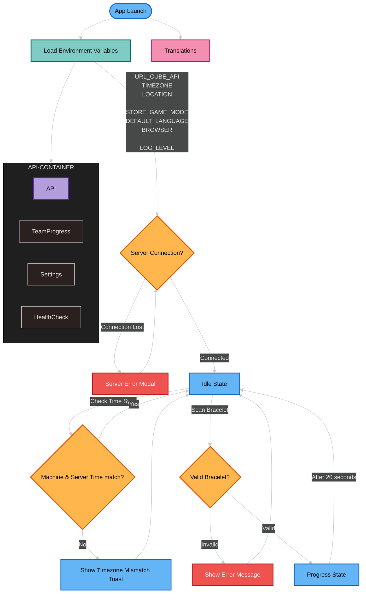

# Cube Apps Progress

## Cube Inside Flow

```mermaid
---
config:
  theme: neo-dark
---
flowchart TB
    %% Entry
    Start(["App Launch"]) --> LoadEnv["Load Environment Variables"] & Translations["Translations"]

    %% Load envs
    LoadEnv --> API-CONTAINER
    LoadEnv -- URL_CUBE_API<br>TIMEZONE<br>LOCATION
    <br>STORE_GAME_MODE<br>DEFAULT_LANGUAGE<br>BROWSER
    <br>LOG_LEVEL --> CheckConnection{"Server Connection?"}

    %% Connection handling
    CheckConnection -- Connection Lost --> ServerError["Server Error Modal"]
    ServerError --> CheckConnection
    CheckConnection -- Connected --> idle["Idle State"]

    %% Idle
    idle -- "Check Time Sync" --> TimeSync{"Machine & Server Time match?"}
    TimeSync -- No --> TimezoneToast["Show Timezone Mismatch Toast"]
    TimezoneToast --> idle
    TimeSync -- Yes --> idle

    %% Scan flow
    idle -- "Scan Bracelet" --> ValidateBracelet{"Valid Bracelet?"}
    ValidateBracelet -- Invalid --> ErrorScan["Show Error Message"]
    ErrorScan --> idle
    ValidateBracelet -- Valid --> Progress["Progress State"]
    Progress -- "After 20 seconds" --> idle

    %% API Container
    subgraph API-CONTAINER
      API["API"]:::apiEntry
      TeamProgress
      Settings
      HealthCheck
    end

    %% Classes
    Start:::applicationState
    LoadEnv:::envState
    Translations:::i18nState
    CheckConnection:::decisionState
    ServerError:::errorState
    idle:::applicationState
    TimeSync:::decisionState
    TimezoneToast:::applicationState
    ValidateBracelet:::decisionState
    ErrorScan:::errorState
    Progress:::applicationState

    %% Colors
    classDef applicationState fill:#64b5f6,stroke:#1565c0,stroke-width:2px,color:#000
    classDef envState fill:#80cbc4,stroke:#00695c,stroke-width:2px,color:#000
    classDef apiEntry fill:#b39ddb,stroke:#512da8,stroke-width:2px,color:#000
    classDef i18nState fill:#f48fb1,stroke:#ad1457,stroke-width:2px,color:#000
    classDef decisionState fill:#ffb74d,stroke:#e65100,stroke-width:2px,color:#000
    classDef errorState fill:#ef5350,stroke:#b71c1c,stroke-width:2px,color:#fff
```